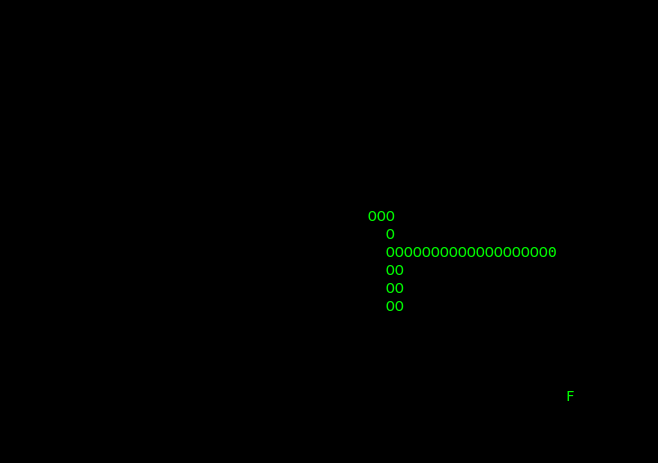

# Snake_AI
Tiny modification from the snake game of Enginner-man (https://github.com/engineer-man/youtube/blob/master/015/snake.py) to add a computer-based solver + allow the snake to cross wall
To decrease speed, change "w.timeout(1)" to "w.timeout(100)" line 9

